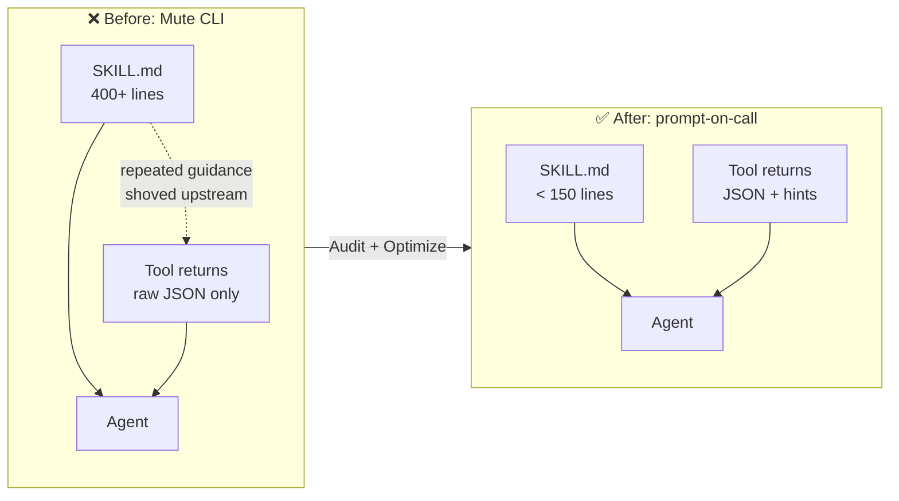
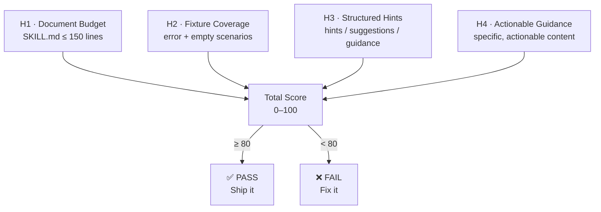

# Talking CLI

> **Tool silence is a design defect. prompt-on-call is the fix.**

[](LICENSE)
[](https://nodejs.org)

**Sound familiar?**

Your `SKILL.md` is 400 lines. Half of it describes what the agent should do *after* a specific tool returns — "if zero results, broaden the query," "if ambiguous, ask the user," "this field means X, not Y." The agent loads all 400 lines every single turn, but most of that guidance only matters 10% of the time. The other 90%, it's paying attention rent on scenarios that didn't happen.

Meanwhile, your tools return raw JSON and say nothing. No hint about what just happened. No signal that results were sparse or the query was ambiguous. No cue for the next step. The tools are mute, so all the guidance gets shoved upstream into `SKILL.md`, which slowly bloats into a monologue describing every possible outcome of every possible call — most of which the agent promptly forgets or ignores.

That's not a skill problem. That's a **prompt surface** problem. You only know one writable surface, so everything goes there.

**Talking CLI gives your tools a voice.** When the agent calls, the tool talks back — not with a wall of prose, but with the right hint, at the right moment, inside the response.     

> That's **prompt-on-call**: progressive disclosure, one level deeper.

---

**Standing on shoulders.** The ideas here did not spring from vacuum.

CLI is the native interface for AI agents — [John Carmack](https://x.com/ID_AA_Carmack/status/1874124927130886501) observed this in late 2024, the [CodeAct](https://arxiv.org/abs/2402.01030) paper (Wang et al., ICML 2024) proved it, and [Andrej Karpathy](https://x.com/karpathy/status/2026360908398862478) crystallized it: *"Build. For. Agents."*

[Progressive disclosure](https://www.anthropic.com/engineering/equipping-agents-for-the-real-world-with-agent-skills) as a skill-loading architecture was formalized by Anthropic (Barry Zhang, Keith Lazuka, Mahesh Murag, Oct 2025) and is now an [open standard](https://agentskills.io) adopted across Claude Code, Codex CLI, and Gemini CLI. [Context engineering](https://www.anthropic.com/engineering/effective-context-engineering-for-ai-agents) as a named discipline was popularized by [Tobi Lütke](https://x.com/tobi) and [Andrej Karpathy](https://x.com/karpathy) in mid-2025.

Anthropic also advocates ["steering agents with helpful instructions in tool responses"](https://www.anthropic.com/engineering/writing-tools-for-agents) — but only as a paragraph-level best practice. Nobody has named it, budgeted it, audited it, or proposed it as a protocol-level primitive. **That gap is what Talking CLI fills.**

---

## What this project is

Talking CLI is a **three-leg stool** built around one idea: **prompt-on-call** — moving guidance from static documents into the moment of invocation.

1. **Methodology** — [PHILOSOPHY.md](PHILOSOPHY.md) + [CN-001](docs/CN-001-tool-scoped-progressive-disclosure.md). Names the Voice channel (C3), budgets the prompt surface, enumerates anti-patterns. The formal name for prompt-on-call's theoretical anchor is *Tool-Scoped Progressive Disclosure*.
2. **Evidence** — the ecosystem audit above, and a reproducible benchmark (in progress, see [Roadmap](#roadmap)).
3. **Standard** — a proposed `agent_hints` convention we are taking to the MCP spec, backed by the data.

The linter (`talking-cli audit` / `audit-mcp`) is the **probe**, not the hero. It's how you reproduce the audit numbers on your own server.

### Core claim

> **Prompt Surface = `SKILL.md` ∪ `{tool_result.hints}` — two halves, one budget.**

Anything you write into `SKILL.md` that only applies *after a specific tool call* is mispriced: it costs every turn and earns only on a small fraction of turns. Moving that guidance into the tool's response (**prompt-on-call**) is the single biggest lever most skill authors haven't pulled.

---

## How it works

### The Prompt Budget Shift (visual)



### Four Heuristics, Full Coverage



---

## Quick Start

```bash
# Audit your skill — default coach mode (plain language, actionable)
npx talking-cli audit ./my-skill

# CI mode — machine-readable, exit code driven
npx talking-cli audit ./my-skill --ci

# JSON mode — structured output for tooling
npx talking-cli audit ./my-skill --json

# Persona mode — same audit, different voice
npx talking-cli audit ./my-skill --persona nba-coach
npx talking-cli audit ./my-skill --persona british-critic
npx talking-cli audit ./my-skill --persona zen-master
npx talking-cli audit ./my-skill --persona emotional-damage-dad

# Audit an MCP server — static analysis (fast, safe)
npx talking-cli audit-mcp ./my-mcp-server

# Deep audit — runtime M3/M4 heuristics (spawns server)
npx talking-cli audit-mcp ./my-mcp-server --deep

# Generate optimization plan (plan-only, never touches source files)
npx talking-cli optimize ./my-skill
# → writes TALKING-CLI-OPTIMIZATION.md at the skill root
```

## API key requirements

Normal `talking-cli` usage does **not** require any model API key.

The following commands are fully local-first:

- `talking-cli audit`
- `talking-cli audit-mcp`
- `talking-cli optimize`

Any model-backed execution belongs only to the internal benchmark harness under `benchmark/`, not to the user-facing CLI contract.

For internal benchmark development today:

- `npm run benchmark:smoke` is wired and local-only using the stub benchmark provider.
- `npm run benchmark` is reserved for the future model-backed standalone executor path and is not Phase 1-complete yet.

---

## What it looks like

Coach mode running against a bloated, mute skill:

```
Score: 0/100
Yikes. Your CLI is so quiet I can hear the tokens screaming in agony.

H1 · Line Count · FAIL
Your SKILL.md is 165 lines. The budget is 150.
→ Just 15 lines over. Tighten the prose and migrate post-call guidance to tool hints.

H2 · Hint Coverage · FAIL
1 tool(s) have zero fixtures. They don't speak at all: search
→ Add talking-cli-fixtures for [search]. One error scenario, one empty/zero-result scenario.
  Make them return a "hints" field.

H3 · Structured Hints · FAIL
0/0 passed fixtures contain hint fields.
→ Make your tools return a "hints" or "suggestions" field alongside raw data.

H4 · Actionable Guidance · FAIL
0/0 hint fields have actionable content.
→ Hints should be specific. "Try again" is too short.
  "Try broadening your query with fewer filters" is actionable.

---
Fix the issues above, then run npx talking-cli audit again to see your new score.
```

(The real output is colored. We just can't show chalk in a code block.)

---

## The finding: MCP Ecosystem Audit

We ran `talking-cli audit-mcp --deep` against **4 official Anthropic MCP servers** across **68 error / empty-result scenarios**. Number of scenarios that returned actionable guidance:

> **0 / 68.**

Static analysis of 823 Composio GitHub tools: same result. Zero hint infrastructure. The MCP ecosystem today treats tool output as a data pipe, not a dialogue participant.

| Server | Tools | Scenarios | M3 · Guidance | M4 · Errors |
|--------|-------|-----------|---------------|-------------|
| `server-filesystem` | 11 | 21 | **0/100** | 74/100 |
| `server-everything` | 13 | 13 | **0/100** | 83/100 |
| `server-memory` | 9 | 9 | **0/100** | 100/100* |
| `server-github` | 25 | 25 | **0/100** | 100/100* |
| **Total** | **58** | **68** | **0/68** | — |

\* M4=100 because Zod validation errors are technically informative. These are SDK-generated messages, not tool-authored recovery guidance.

**What's coming**: a quantitative benchmark comparing the same agent on mute vs. talking variants of the same server (tokens, turns, success rate). If the delta is real, silence has a price and we can name it. If it isn't, we will publish that too.

---

## The Methodology

Talking CLI is more than a linter. It's the implementation of **prompt-on-call**: every tool response is a designed prompt surface, not a data dump.

- **[PHILOSOPHY.md](PHILOSOPHY.md)** — the full methodology: four channels, four rules, a budget, and five anti-patterns.
- **[docs/CN-001](docs/CN-001-tool-scoped-progressive-disclosure.md)** — the formal theoretical anchor (*Tool-Scoped Progressive Disclosure*).

---

## Roadmap

**v0.5 endgame** — the project pivots from "another linter" to **evidence-first standard proposal**. Execution plan lives in [`.internal/TDD-P4.md`](.internal/TDD-P4.md); PRD in [`.internal/PRD.md`](.internal/PRD.md) §0.0 and §7.

| Track | Goal | Status |
|---|---|---|
| **Methodology** (shipped) | PHILOSOPHY + CN-001 + H1–H4 / M1–M4 heuristics | ✅ |
| **Evidence harness** (G7 / P4.1) | Internal benchmark harness comparing mute vs. talking variants under controlled execution | 🔄 next |
| **Ecosystem audit publication** (G8 / P4.2) | `AUDIT-BENCHMARK.md` as re-runnable artifact, public post | 🔄 blocked on G7 |
| **H4 semantic upgrade** (G9 / P4.3) | Haiku-class classifier replaces the `≥ 10 chars` stub; graceful fallback without API key | ⏳ |
| **H3 hint-budget ≤ 3** (G9 / P4.4) | Semantic dedup of hints, not field-count | ⏳ |
| **Persona cut** (D1 / P4.5) | 5 hand-coded personas → 1 default + 1 experimental | ⏳ |
| **Self-dogfood** (G11 / P4.6) | `talking-cli audit .` ≥ 90/100, CI-enforced, README badge | ⏳ |
| **MCP spec proposal** (G10 / P4.7) | RFC / discussion on `modelcontextprotocol/*` for a first-class `agent_hints` field | ⏳ |

### Status of surfaces available today

- ✅ H1–H4 skill audit (`audit`) — v1 heuristics; H3/H4 will harden in P4.3–4.4
- ✅ M1–M4 MCP server audit (`audit-mcp --deep`)
- ✅ `optimize` plan + `--apply` with git branch safety
- 🧪 Multiple personas (`--persona`) — **experimental**, surface will shrink in P4.5
- ⛔ `optimize --workflow` (9-step pipeline) — specified in PRD §11, deferred past P4

## License

MIT
