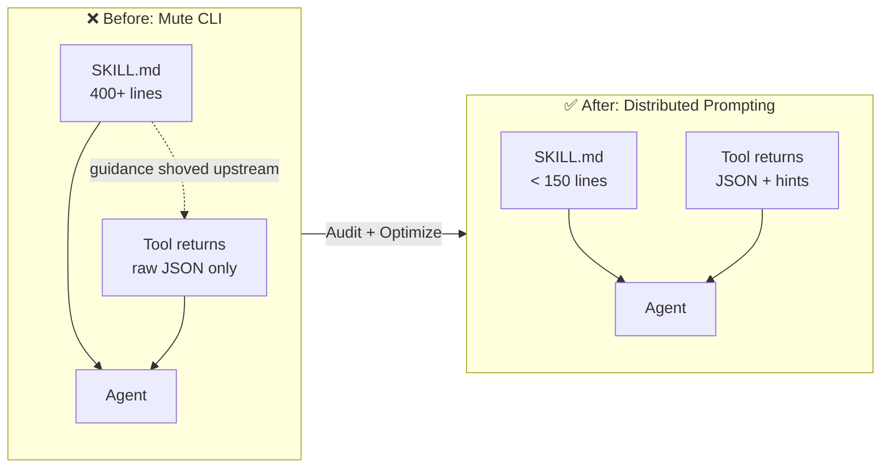
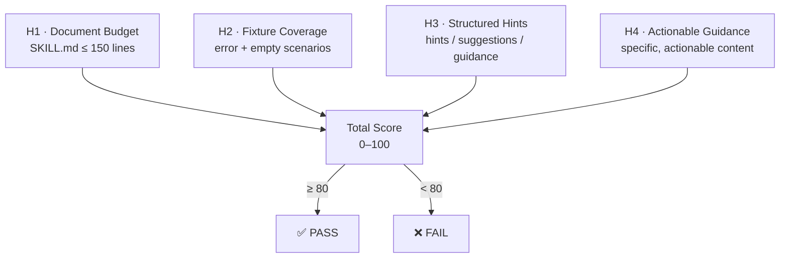

# Talking CLI

> **Tool silence is a design defect. Distributed Prompting is the fix.**

[](LICENSE)
[](https://nodejs.org)
[](#what-this-project-is)
[](https://github.com/DrDexter6000/talking-cli/actions)

> The self-audit badge shows talking-cli's own audit score (100/100). CI enforces ≥80 on every PR.

**Sound familiar?**

Your `SKILL.md` is 400 lines. Half of it describes what the agent should do *after* a specific tool returns — "if zero results, broaden the query," "if ambiguous, ask the user," "this field means X, not Y."

The agent loads all 400 lines every single turn, but most of that guidance only matters 10% of the time. The other 90%, it's paying attention rent on scenarios that didn't happen.

Meanwhile, your tools return raw JSON and say nothing. No hint about what just happened. No signal that results were sparse or the query was ambiguous. The tools are mute, so all the guidance gets shoved upstream into `SKILL.md`, which slowly bloats into a monologue describing every possible outcome — most of which the agent promptly forgets or ignores.

**Talking CLI gives your tools a voice.** When the agent calls, the tool talks back — with the right hint, at the right moment, inside the response. We call this **Prompt-On-Call**: guidance that surfaces only when a tool is called, relevant only to what just happened.

The cumulative effect is **Distributed Prompting**: a prompt surface spread across every tool response, not crammed into one bloated document.

---

**Standing on shoulders.** CLI is the native interface for AI agents — [Carmack](https://x.com/ID_AA_Carmack/status/1874124927130886501), [CodeAct](https://arxiv.org/abs/2402.01030) (Wang et al., ICML 2024), and [Karpathy](https://x.com/karpathy/status/2026360908398862478) crystallized it.

[Progressive disclosure](https://www.anthropic.com/engineering/equipping-agents-for-the-real-world-with-agent-skills) as a skill-loading architecture was formalized by Anthropic (Oct 2025) and is now an [open standard](https://agentskills.io). Anthropic also advocates ["steering agents with helpful instructions in tool responses"](https://www.anthropic.com/engineering/writing-tools-for-agents) — but only as a paragraph-level best practice. Nobody has named it, budgeted it, audited it, or proposed it as a protocol-level primitive. **That gap is what Talking CLI fills.**

---

## What this project is

Talking CLI is built around one idea: **Distributed Prompting** — moving guidance from static `SKILL.md` into the moment of invocation.

1. **Methodology** — [PHILOSOPHY.md](PHILOSOPHY.md): Four Channels (C1–C4), Four Rules of Talk, a prompt budget, and five anti-patterns.
2. **Evidence** — a reproducible 2×2 ablation benchmark across 15 curated tasks (published below).
3. **Standard** — a proposed `agent_hints` convention we are taking to the MCP spec, backed by the data.

The linter (`talking-cli audit` / `audit-mcp`) is the **probe**, not the hero. It's how you reproduce the audit numbers on your own skill.

### Core claim

> **Prompt Surface = `SKILL.md` ∪ `{tool_result.hints}` — two halves, one budget.**

Anything you write into `SKILL.md` that only applies *after a specific tool call* is mispriced: it costs every turn and earns only on a small fraction of turns. Tool hints fix the pricing.

---

## How it works

### The Prompt Budget Shift



### Four Heuristics, One Score



---

## Quick Start

```bash
# Audit your skill — coach mode (plain language, actionable)
npx talking-cli audit ./my-skill

# CI mode — machine-readable, exit code driven
npx talking-cli audit ./my-skill --ci

# JSON mode — structured output for tooling
npx talking-cli audit ./my-skill --json

# Audit an MCP server — static analysis (fast, safe)
npx talking-cli audit-mcp ./my-mcp-server

# Deep audit — runtime heuristics (spawns server)
# ⚠️ Only use --deep on servers you trust. See SECURITY.md.
npx talking-cli audit-mcp ./my-mcp-server --deep

# Generate optimization plan (plan-only, never touches source files)
npx talking-cli optimize ./my-skill

# Scaffold a new skill directory with templates that pass audit
npx talking-cli init my-skill
cd my-skill
npx talking-cli audit .
```

All commands are fully local — no API key required.

---

## What it looks like

Coach mode running against a bloated, mute skill:

```
Score: 0/100
Yikes. Your CLI is so quiet I can hear the tokens screaming in agony.

H1 · Line Count · FAIL
Your SKILL.md is 165 lines. The budget is 150.
→ Just 15 lines over. Tighten the prose and migrate post-call guidance to tool hints.

H2 · Hint Coverage · FAIL
1 tool(s) have zero fixtures. They don't speak at all: search
→ Add talking-cli-fixtures for [search]. One error, one empty-result scenario.

H3 · Structured Hints · FAIL
0/0 passed fixtures contain hint fields.
→ Make your tools return a "hints" or "suggestions" field alongside raw data.

H4 · Actionable Guidance · FAIL
0/0 hint fields have actionable content.
→ Hints should be specific. "Try broadening your query with fewer filters" is actionable.

---
Fix the issues above, then run npx talking-cli audit again to see your new score.
```

(The real output is colored. We just can't show chalk in a code block.)

---

## The finding: MCP Ecosystem Audit

We ran `talking-cli audit-mcp --deep` against **4 official Anthropic MCP servers** across **68 error / empty-result scenarios**. Number of scenarios that returned actionable guidance:

> **0 / 68.**

Static analysis of 823 Composio GitHub tools: same result. The MCP ecosystem today treats tool output as a data pipe, not a dialogue participant.

| Server | Tools | Scenarios | M3 · Guidance |
|--------|-------|-----------|---------------|
| `server-filesystem` | 11 | 21 | **0** |
| `server-everything` | 13 | 13 | **0** |
| `server-memory` | 9 | 9 | **0** |
| `server-github` | 25 | 25 | **0** |
| **Total** | **58** | **68** | **0 / 68** |

### Cross-Model Validation (3 providers, 45+ tasks)

We ran a full 2×2 ablation (Full/Lean Skill × Mute/Hinting Tools) across **three frontier models** — DeepSeek V4 Pro, Kimi K2.6, and GLM-5.1 — on **45 MCP tasks** (filesystem, memory, fetch, multi-tool) with k=3 trials per cell, then repeated with **15 harder tasks** on 2 models.

**2,340+ total executions.** Each cell evaluated independently.

| Model | C1: Full/Mute | C4: Lean/Hints | C4−C1 Δ | Token Savings |
|-------|:----------:|:----------:|:-------:|:------------:|
| DeepSeek V4 Pro | 91.1% | 90.4% | −0.7 pp | **−17%** |
| Kimi K2.6 | 88.1% | 90.4% | +1.5 pp | **−18%** |
| GLM-5.1 | 90.4% | 93.3% | +2.2 pp | **−22%** |

Round 5 harder tasks (2 models, ceiling eliminated, 24–26% token savings):

| Model | C1: Full/Mute | C4: Lean/Hints | C4−C1 Δ | Token Savings |
|-------|:----------:|:----------:|:-------:|:------------:|
| DeepSeek V4 Pro | 22.2% | 22.2% | 0.0 pp | **−24%** |
| GLM-5.1 | 20.0% | 20.0% | 0.0 pp | **−26%** |

**What the data supports:**

- **Token efficiency is robust and model-agnostic**: Lean Skill + Hints saves 17–26% input tokens across all providers and task difficulties, with zero quality degradation. This is the strongest finding.
- **No harm**: the treatment condition (C4) never catastrophically underperforms the control (C1). Worst case: DeepSeek at −0.7pp, within noise.
- **Skill bloat is real**: compressing an 873-line skill to 168 lines improves or maintains quality while cutting tokens. SkillsBench (arXiv 2602.12670, 36,000 real-world skills) independently found that comprehensive skills at P99.5 degrade performance by −2.9pp while moderate skills improve it by +18.8pp.
- **Ceiling effect is fixable**: Round 5 harder tasks eliminated the 76% ceiling to 0%, confirming task difficulty was the measurement blocker.

**What the data does not support:**

- Pass-rate improvement is not statistically significant (sign test p = 1.0 for all models in both rounds). Even with harder tasks, C1 and C4 pass rates are identical.
- **Adding hints to a verbose skill can hurt**: on GLM-5.1, the Full Skill + Hints cell scored 84.4% — 6pp below the Full Skill + Mute control. Distributed Prompting only helps when the skill is compressed; stacking hints on top of an 873-line skill creates information overload.

**Verdict: PARTIAL** — token savings are proven and scale with task difficulty; quality improvement remains unproven after 2,340+ executions. We're being honest about what the data says.

---

## The Methodology

Talking CLI is the reference implementation of **Distributed Prompting**: every tool response is a designed prompt surface, not a data dump. **Prompt-On-Call** is the concrete mechanism — guidance that arrives when the tool is called, relevant to what just happened. The cumulative effect across every tool in the system is Distributed Prompting.

- **[PHILOSOPHY.md](PHILOSOPHY.md)** — the methodology: Four Channels, Four Rules, a budget, and five anti-patterns.
- **[Adversarial Case Study](docs/ADVERSARIAL-CASE-STUDY.md)** — where Distributed Prompting fails, and what to do about it.

---

## What's next

- **Harder benchmarks** — tasks calibrated to 40–60% baseline on current frontier models, to measure the quality signal that is currently buried by ceiling effects
- **MCP spec proposal** — RFC for a first-class `agent_hints` field in tool responses
- **H4 semantic upgrade** — replacing the `≥ 10 chars` heuristic with a lightweight classifier
- **C2 anomaly investigation** — why adding hints to verbose skills hurts some models

---

## License

MIT
