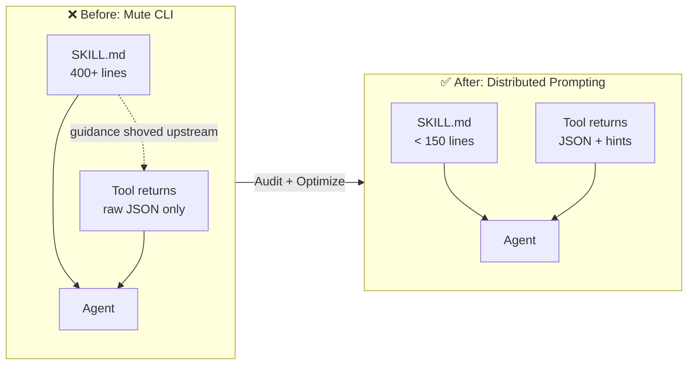
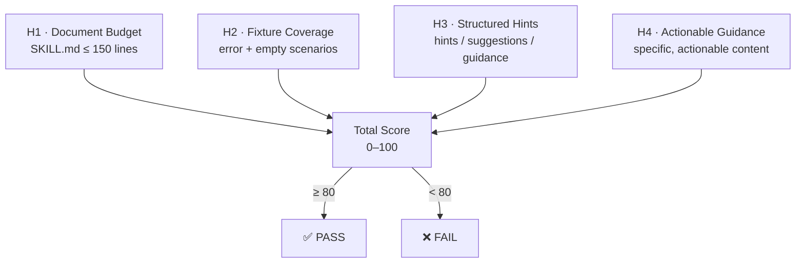

<div align="center">

# Talking CLI

[English](https://github.com/DrDexter6000/talking-cli) · [中文](README.zh-CN.md)

> **Mute tools bloat your prompts. Tool hints fix the budget.**

[](LICENSE)
[](https://nodejs.org)
[](#core-claim)
[](https://github.com/DrDexter6000/talking-cli/actions)

</div>

---

## One-liner

Talking CLI is a linter that audits whether your AI skill and MCP tools have moved guidance out of bloated `SKILL.md` and into the tool responses themselves — giving tools a voice at the moment they are called.

---

## The Problem

Three chronic diseases in today's AI toolchains:

- **Tools are mute** — they return raw JSON and say nothing about errors, empty results, or ambiguity
- **Documents bloat** — every *"if zero results, broaden the query"* and *"if ambiguous, ask the user"* gets shoved into `SKILL.md`, 400+ lines loaded in full every turn
- **Budget leaks** — 90% of that guidance is noise 90% of the time, yet the agent pays token rent on all of it

---

## Core Claim

> **Prompt Surface = `SKILL.md` ∪ `{tool_result.hints}` — two halves, one budget.**

Move guidance that only applies after a specific tool call from static documents into dynamic responses. The tool speaks only when called, and only about what just happened. We call this **Prompt-On-Call**; the cumulative effect across every tool is **Distributed Prompting**.

| 🎯 Token Savings | 🧪 Validation Scale | 🤖 Model Coverage | 🔍 Ecosystem Audit |
|:---:|:---:|:---:|:---:|
| **17–26%** | **2,340+** executions | **3** frontier models | **0/68** pass |
| Lean Skill + Tool Hints | Cross-difficulty, cross-model | DeepSeek / Kimi / GLM | 4 official Anthropic MCP servers |

[Anthropic](https://www.anthropic.com/engineering/writing-tools-for-agents) and [Carmack](https://x.com/ID_AA_Carmack/status/1874124927130886501) have pointed at this direction, but nobody has named it, budgeted it, or audited it — until now.

<details>
<summary><strong>Standing on shoulders</strong> — why now?</summary>

CLI is the native interface for AI agents — [Carmack](https://x.com/ID_AA_Carmack/status/1874124927130886501), [CodeAct](https://arxiv.org/abs/2402.01030) (Wang et al., ICML 2024), and [Karpathy](https://x.com/karpathy/status/2026360908398862478) crystallized it.

[**Progressive Disclosure**](https://www.anthropic.com/engineering/equipping-agents-for-the-real-world-with-agent-skills) as a skill-loading architecture was formalized by Anthropic (Oct 2025) and is now an [open standard](https://agentskills.io). Anthropic also advocates ["steering agents with helpful instructions in tool responses"](https://www.anthropic.com/engineering/writing-tools-for-agents) — but only as a paragraph-level best practice. Nobody has named it, budgeted it, audited it, or proposed it as a protocol-level primitive. **That gap is what Talking CLI fills.** We believe **Prompt-On-Call** / **Distributed Prompting** is the next evolutionary step of this idea.

</details>

---

## How It Works

### Mechanism: The Prompt Budget Shift

| | Mute CLI (Before) | Distributed Prompting (After) |
|---|---|---|
| **SKILL.md** | 400+ lines, full load every turn | < 150 lines, generic guidance only |
| **Tool Response** | Raw JSON, zero hints | JSON + `hints` field, context-aware guidance |
| **Prompt Cost** | Paying rent on 400 lines per turn | Paying only for precise hints at call time |
| **Audit** | None | `talking-cli audit` scores four heuristics |

<details>
<summary>📊 Visual: Before vs After</summary>



</details>

### Four Heuristics, One Score

| Heuristic | What It Checks | Pass Threshold |
|---|---|---|
| **H1 · Document Budget** | SKILL.md line count | ≤ 150 lines |
| **H2 · Fixture Coverage** | Error + empty-result scenarios | ≥ 2 fixtures per tool |
| **H3 · Structured Hints** | Response contains hint fields | `hints` / `suggestions` / `guidance` |
| **H4 · Actionable Guidance** | Hint content is specific and actionable | ≥ 10 chars with action verbs |

> Total score 0–100. ≥ 80 to pass.

<details>
<summary>📊 Visual: Scoring Flow</summary>



</details>

---

## Quick Start

```bash
# Audit your skill — plain language report telling you what to fix
npx talking-cli audit ./my-skill

# CI mode — machine-readable, exit-code driven
npx talking-cli audit ./my-skill --ci

# JSON mode — structured output for tooling integration
npx talking-cli audit ./my-skill --json

# Audit an MCP server — static analysis (fast, safe)
npx talking-cli audit-mcp ./my-mcp-server

# Deep audit — runtime heuristics (spawns server)
# ⚠️ Only use --deep on servers you trust. See SECURITY.md.
npx talking-cli audit-mcp ./my-mcp-server --deep

# Generate optimization plan (plan-only, never touches source)
npx talking-cli optimize ./my-skill

# Scaffold a new skill directory with audit-passing templates
npx talking-cli init my-skill
```

All commands run fully local — no API key required.

---

## Experimental Validation

### MCP Ecosystem Audit

**0 / 68.** We scanned 4 official Anthropic MCP servers across 68 error / empty-result scenarios. None returned actionable guidance. Static analysis of 823 Composio tools showed the same result.

| Server | Tools | Scenarios | Guidance Returned |
|---|---|---|:---:|
| `server-filesystem` | 11 | 21 | **0** |
| `server-everything` | 13 | 13 | **0** |
| `server-memory` | 9 | 9 | **0** |
| `server-github` | 25 | 25 | **0** |
| **Total** | **58** | **68** | **0 / 68** |

### Cross-Model Validation (2,340+ executions)

Full 2×2 ablation (Full/Lean Skill × Mute/Hinting Tools) across **3 frontier models** on 45 MCP tasks (k=3 trials per cell), plus 15 harder tasks on 2 models:

| Model | Full/Mute | Lean/Hints | Δ | Token Save | Hard Baseline | Hard Δ | Hard Save |
|---|---|---:|:---:|:---:|:---:|:---:|:---:|
| DeepSeek V4 Pro | 91.1% | 90.4% | −0.7 | **−17%** | 22.2% / 22.2% | 0.0 | **−24%** |
| Kimi K2.6 | 88.1% | 90.4% | +1.5 | **−18%** | — | — | — |
| GLM-5.1 | 90.4% | 93.3% | +2.2 | **−22%** | 20.0% / 20.0% | 0.0 | **−26%** |

**What the data supports:**
- **Token efficiency is cross-model and cross-difficulty**: 17–26% savings with zero quality degradation
- **No harm**: worst case is −0.7pp, within noise
- **Skill bloat is real**: SkillsBench (36K real-world skills) independently found verbose skills degrade by −2.9pp while moderate ones improve by +18.8pp

**What the data does not support:**
- Pass-rate improvement is not statistically significant (p = 1.0) — token savings are proven; quality signal remains unproven
- **Adding hints to a verbose skill can hurt** (GLM-5.1: −6pp). Distributed Prompting only works when the skill is compressed first

---

## What's Next

1. **Harder benchmarks** — tasks calibrated to 40–60% baseline to surface quality signal currently buried by ceiling effects
2. **MCP spec proposal** — RFC for a first-class `agent_hints` field in tool responses
3. **H4 semantic upgrade** — replacing the `≥ 10 chars` heuristic with a lightweight classifier

---

## License

MIT
