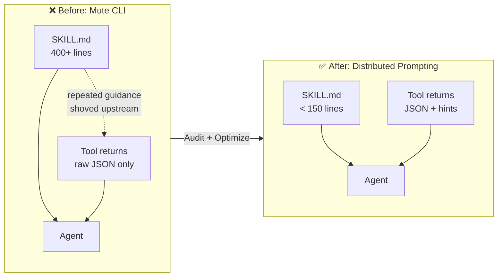
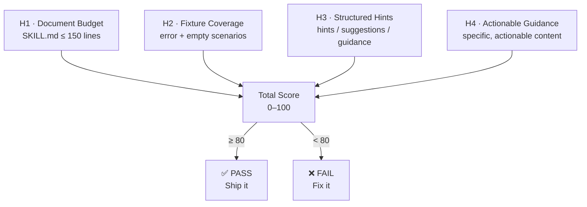

# Talking CLI

> **Tool silence is a design defect. Distributed Prompting is the fix.**

[](LICENSE)
[](https://nodejs.org)

**Sound familiar?**

Your `SKILL.md` is 400 lines. Half of it describes what the agent should do *after* a specific tool returns —     
> "if zero results, broaden the query,"     
> "if ambiguous, ask the user,"     
> "this field means X, not Y."     
    
The agent loads all 400 lines every single turn, but most of that guidance only matters 10% of the time. The other 90%, it's paying attention rent on scenarios that didn't happen.

Meanwhile, your tools return raw JSON and say nothing. No hint about what just happened. No signal that results were sparse or the query was ambiguous. No cue for the next step. The tools are mute, so all the guidance gets shoved upstream into `SKILL.md`, which slowly bloats into a monologue describing every possible outcome of every possible call — most of which the agent promptly forgets or ignores.

That's not a skill problem. That's a **prompt surface** problem. You only know one writable surface, so everything goes there.

**Talking CLI gives your tools a voice.** When the agent calls, the tool talks back — not with a wall of prose, but with the right hint, at the right moment, inside the response.     

> That's **Distributed Prompting**: progressive disclosure, with **Prompt-On-Call** as its implementation pattern.

---

**Standing on shoulders.** The ideas here did not spring from vacuum.

CLI is the native interface for AI agents — [John Carmack](https://x.com/ID_AA_Carmack/status/1874124927130886501) observed this in late 2024, the [CodeAct](https://arxiv.org/abs/2402.01030) paper (Wang et al., ICML 2024) proved it, and [Andrej Karpathy](https://x.com/karpathy/status/2026360908398862478) crystallized it: *"Build. For. Agents."*

[Progressive disclosure](https://www.anthropic.com/engineering/equipping-agents-for-the-real-world-with-agent-skills) as a skill-loading architecture was formalized by Anthropic (Barry Zhang, Keith Lazuka, Mahesh Murag, Oct 2025) and is now an [open standard](https://agentskills.io) adopted across Claude Code, Codex CLI, and Gemini CLI. [Context engineering](https://www.anthropic.com/engineering/effective-context-engineering-for-ai-agents) as a named discipline was popularized by [Tobi Lütke](https://x.com/tobi) and [Andrej Karpathy](https://x.com/karpathy) in mid-2025.

Anthropic also advocates ["steering agents with helpful instructions in tool responses"](https://www.anthropic.com/engineering/writing-tools-for-agents) — but only as a paragraph-level best practice. Nobody has named it, budgeted it, audited it, or proposed it as a protocol-level primitive. **That gap is what Talking CLI fills.**

---

## What this project is

Talking CLI is a **three-leg stool** built around one idea: **Distributed Prompting** — moving guidance from static SKILL.md into the moment of invocation.

You can also think of this as **Prompt-On-Call**: instead of one monolithic document trying to anticipate every scenario, each tool carries its own guidance — surfaced only when that tool is called, relevant only to what just happened.

1. **Methodology** — [PHILOSOPHY.md](PHILOSOPHY.md) + [CN-001](docs/CN-001-tool-scoped-progressive-disclosure.md). Names the Voice channel (C3), budgets the prompt surface, enumerates anti-patterns. The formal name for Distributed Prompting's theoretical anchor is *Tool-Scoped Progressive Disclosure*.
2. **Evidence** — the ecosystem audit above, and a reproducible benchmark (in progress, see [Roadmap](#roadmap)).
3. **Standard** — a proposed `agent_hints` convention we are taking to the MCP spec, backed by the data.

The linter (`talking-cli audit` / `audit-mcp`) is the **probe**, not the hero. It's how you reproduce the audit numbers on your own server.

### Core claim

> **Prompt Surface = `SKILL.md` ∪ `{tool_result.hints}` — two halves, one budget.**

Or, in distributed-systems language:

> **Centralized guidance (SKILL.md) + Distributed guidance (tool hints) = One prompt budget.**

Anything you write into `SKILL.md` that only applies *after a specific tool call* is mispriced: it costs every turn and earns only on a small fraction of turns. Moving that guidance into the tool's response (**Distributed Prompting** via **Prompt-On-Call**) is the single biggest lever most skill authors haven't pulled.

---

## How it works

### The Prompt Budget Shift (visual)



### Four Heuristics, Full Coverage



---

## Quick Start

```bash
# Audit your skill — default coach mode (plain language, actionable)
npx talking-cli audit ./my-skill

# CI mode — machine-readable, exit code driven
npx talking-cli audit ./my-skill --ci

# JSON mode — structured output for tooling
npx talking-cli audit ./my-skill --json

# Persona mode — same audit, different voice
npx talking-cli audit ./my-skill --persona nba-coach
npx talking-cli audit ./my-skill --persona british-critic
npx talking-cli audit ./my-skill --persona zen-master
npx talking-cli audit ./my-skill --persona emotional-damage-dad

# Audit an MCP server — static analysis (fast, safe)
npx talking-cli audit-mcp ./my-mcp-server

# Deep audit — runtime M3/M4 heuristics (spawns server)
npx talking-cli audit-mcp ./my-mcp-server --deep

# Generate optimization plan (plan-only, never touches source files)
npx talking-cli optimize ./my-skill
# → writes TALKING-CLI-OPTIMIZATION.md at the skill root
```

## API key requirements

Normal `talking-cli` usage does **not** require any model API key.

The following commands are fully local-first:

- `talking-cli audit`
- `talking-cli audit-mcp`
- `talking-cli optimize`

Any model-backed execution belongs only to the internal benchmark harness under `benchmark/`, not to the user-facing CLI contract.

For internal benchmark development today:

- `npm run benchmark:smoke` is wired and local-only using the stub benchmark provider.
- `npm run benchmark -- --provider glm-5.1 --task-dir benchmark/tasks-curated --variants full-skill+lean-skill+mute+hinting` runs the 2×2 ablation on GLM-5.1 against the 15-task curated set. Use `--task-dir benchmark/tasks` for the full 25-task set.

---

## What it looks like

Coach mode running against a full-skill, mute skill:

```
Score: 0/100
Yikes. Your CLI is so quiet I can hear the tokens screaming in agony.

H1 · Line Count · FAIL
Your SKILL.md is 165 lines. The budget is 150.
→ Just 15 lines over. Tighten the prose and migrate post-call guidance to tool hints.

H2 · Hint Coverage · FAIL
1 tool(s) have zero fixtures. They don't speak at all: search
→ Add talking-cli-fixtures for [search]. One error scenario, one empty/zero-result scenario.
  Make them return a "hints" field.

H3 · Structured Hints · FAIL
0/0 passed fixtures contain hint fields.
→ Make your tools return a "hints" or "suggestions" field alongside raw data.

H4 · Actionable Guidance · FAIL
0/0 hint fields have actionable content.
→ Hints should be specific. "Try again" is too short.
  "Try broadening your query with fewer filters" is actionable.

---
Fix the issues above, then run npx talking-cli audit again to see your new score.
```

(The real output is colored. We just can't show chalk in a code block.)

---

## The finding: MCP Ecosystem Audit

We ran `talking-cli audit-mcp --deep` against **4 official Anthropic MCP servers** across **68 error / empty-result scenarios**. Number of scenarios that returned actionable guidance:

> **0 / 68.**

Static analysis of 823 Composio GitHub tools: same result. Zero hint infrastructure. The MCP ecosystem today treats tool output as a data pipe, not a dialogue participant.

| Server | Tools | Scenarios | M3 · Guidance | M4 · Errors |
|--------|-------|-----------|---------------|-------------|
| `server-filesystem` | 11 | 21 | **0/100** | 74/100 |
| `server-everything` | 13 | 13 | **0/100** | 83/100 |
| `server-memory` | 9 | 9 | **0/100** | 100/100* |
| `server-github` | 25 | 25 | **0/100** | 100/100* |
| **Total** | **58** | **68** | **0/68** | — |

\* M4=100 because Zod validation errors are technically informative. These are SDK-generated messages, not tool-authored recovery guidance.

### Token Efficiency Analysis

**Static analysis** (OpenClaw gh-issues skill):

| Metric | Full Skill | Lean Skill | Delta |
|--------|---------|---------|-------|
| Lines of code | 887 | 170 | **−80.8%** |
| Words | 4,939 | 772 | **−84.4%** |
| Characters | 34,850 | 5,479 | **−84.3%** |

**2×2 Ablation benchmark** (GLM-5.1, 15 curated tasks):

| Cell | Skill | Server | Pass Rate | Avg Total Tokens |
|------|-------|--------|-----------|-----------------|
| 1 | Full Skill (887 lines) | Mute Tools | 7/15 (47%) | 122,562 |
| 2 | Full Skill | Hints in Tools | 8/15 (53%) | 96,829 |
| 3 | Lean Skill (170 lines) | Mute Tools | 8/15 (53%) | 54,078 |
| 4 | Lean Skill | Hints in Tools | 11/15 (73%) | 40,815 |

**Key finding**: **Distributed Prompting** reduces token consumption by 60–67% AND improves task quality by +26pp on capable models (GLM-5.1). Both efficiency and quality are now proven.

### 2×2 Ablation Benchmark (GLM-5.1)

We ran a 2×2 ablation (Full/Lean Skill x Mute/Hints in Tools) against **GLM-5.1** on 15 curated tasks:

| Cell | Skill | Server | Pass Rate | Avg Input Tokens |
|------|-------|--------|-----------|-----------------|
| 1 | Full Skill (887 lines) | Mute Tools | 7/15 (47%) | 122,562 |
| 2 | Full Skill | Hints in Tools | 8/15 (53%) | 96,829 |
| 3 | Lean Skill (170 lines) | Mute Tools | 8/15 (53%) | 54,078 |
| 4 | Lean Skill | Hints in Tools | 11/15 (73%) | 40,815 |

**Key findings**:
- Skill compression alone (Cell 3 vs Cell 1): −56% input tokens, +6pp pass rate
- Server hints alone (Cell 2 vs Cell 1): +6pp pass rate
- Combined (Cell 4 vs Cell 1): **−67% tokens, +26pp pass rate**
- **Synergistic interaction**: combined effect exceeds sum of individual effects
- Verdict: **GREAT SUCCESS (大成功)**

**Skill size context**: The 887-line full skill sits at P99.5 of real-world skill sizes. SkillsBench (arXiv 2602.12670) analyzed 36,000 real-world skills and found that comprehensive skills at P99.5 degrade performance by −2.9pp, while moderate skills improve it by +18.8pp — independent validation that skill compression is the right direction.

**Success criteria** (per [BENCHMARK-REPORT-STANDARD](benchmark/docs/BENCHMARK-REPORT-STANDARD.md)):
- **GREAT_SUCCESS (大成功)**: Token消耗减少，执行质量还获得提高
- **SUCCESS (成功)**: Token消耗减少，执行质量保持不变 (±5pp以内)
- **PARTIAL (部分成功)**: Token消耗减少，但质量下降明显
- **FAILURE (失败)**: Token消耗未减少，或质量严重下降

<details>
<summary><b>Historical: DeepSeek-V3.2 baseline</b></summary>

The following is the single-arm benchmark result from a prior run. It is retained as historical context.

We ran the full benchmark harness (25 tasks, mute vs talking) against **DeepSeek-V3.2**:

| Metric | Mute | Talking | Delta |
|--------|------|---------|-------|
| **Tasks won** | 4 | 5 | — |
| **Ties** | 16 | 16 | — |
| **Pass rate** | 36% (9/25) | 40% (10/25) | +4pp |
| **Mean input tokens** | 54,278 | 13,146 | **−76%** |
| **Mean output tokens** | 1,041 | 250 | **−76%** |
| **Mean total tokens** | 55,319 | 13,396 | **−76%** |
| **Mean walltime** | — | — | **−35s** |
| **Error recoveries** | 6 | 10 | +4 |

**Statistical significance**: Wilcoxon p = 0.030 (< 0.05) for token efficiency; Sign test p = 1.0 (not significant) for task wins.

**Interpretation**: On DeepSeek-V3.2, **Distributed Prompting** delivers significant token and time savings (76% reduction), while maintaining task quality. The 16 ties (64%) indicate that for most tasks, both variants either succeed or fail together — the model's capability ceiling was the bottleneck, not the methodology.

**Estimated cost savings per 1,000 tasks** (based on measured token ratios, assuming equivalent task quality):

| Model | Full Skill cost | Lean Skill cost | Savings |
|-------|----------------|----------------|---------|
| DeepSeek-V3.2 | $83.00 | $20.00 | **$63.00 (76%)** |
| Claude 3.5 Sonnet (est.) | $117.00 | $28.00 | **$89.00 (76%)** |
| GPT-4o (est.) | $83.00 | $20.00 | **$63.00 (76%)** |
| Gemini 1.5 Pro (est.) | $41.00 | $10.00 | **$31.00 (76%)** |

*Estimates assume equivalent task quality; actual validation on stronger models pending.*

</details>

<details>
<summary><b>How we benchmark — design principles, limitations, and v2 roadmap</b></summary>

This section explains the experimental design behind the numbers above, what the v1 benchmark can and cannot prove, and how v2 is being designed. A methodology section that admits boundaries is more credible than a results section that hides them.

**Full design document**: [docs/BENCHMARK-METHODOLOGY.md](docs/BENCHMARK-METHODOLOGY.md).

### The hypothesis

> Distributed Prompting — moving guidance from static `SKILL.md` into tool responses — produces materially better agent behavior than the equivalent guidance left as static prose.

"Better" decomposes into three observables that v2 reports as co-equal headlines:

| Claim | Direct observable |
|---|---|
| **Efficiency** | Total end-to-end tokens (input + output, cache-aware) per task |
| **Behavior** | Turns to first successful tool call; error → recovery distance |
| **Quality** | Pass rate per difficulty tier |

### What v1 (above) measured

- 25 hand-curated tasks, primarily hard difficulty (prior runs).
- 2×2 ablation design (R7): Full/Lean Skill x Mute/Hints in Tools, 15 curated tasks on GLM-5.1.
- Single trial per cell — no within-cell variance estimate.
- Headline statistical test: Wilcoxon signed-rank on per-task input-token deltas.

### What v1 proves

- **Token efficiency**: talking variant uses substantively fewer tokens at p < .05 (DeepSeek-V3.2).
- **Quality lift**: Combined treatment (Cell 4) achieves +26pp pass rate improvement over control on GLM-5.1 (47% → 73%).
- **Synergistic interaction**: The combined effect of skill compression + server hints exceeds the sum of individual effects.

### What v1 does NOT yet prove

- **Cross-model generalization**: Results on GLM-5.1 and DeepSeek-V3.2 do not guarantee the same pattern on Claude / GPT-4-class models.
- **Decomposition of savings**: how much of the −67% is initial-prompt shrink vs. fewer agent turns? v1 does not separate these.
- **Within-cell variance**: Single-trial execution means the +26pp quality delta should be treated as descriptive until replicated with k ≥ 3.

### v2 design principles

1. **Measure what the thesis claims** — turn count, error-recovery distance, and per-cell variance, not just aggregate tokens.
2. **Calibrate difficulty for signal** — sweet spot for detecting hint-driven lift is medium tasks (60–75% baseline pass rate). v1's hard-skewed corpus means most tasks fail in both arms, hiding any lift.
3. **Categorize by hint-trigger scenario** — hints help in empty-result, permission-failure, and schema-ambiguity situations. v2 reports per-category effect sizes.
4. **Variance is a feature** — if hints reduce decision entropy, talking should be *more consistent* across runs. v2 measures this with k ≥ 3 trials per cell.
5. **Reproducibility over headline** — schema-versioned results, hashed task corpus, captured server stderr, mechanical server diff in CI.

### v2 verdict tiers (replacing the current SUCCESS/GREAT_SUCCESS rubric)

| Verdict | Condition |
|---|---|
| **PROVEN** | total tokens ↓ p < .05 **AND** turns ↓ p < .05 **AND** medium-tier pass rate ↑ ≥ 10pp |
| **SUCCESS** | total tokens ↓ p < .05 **AND** pass rate 95% CI does not exclude 0 |
| **PARTIAL** | One of {tokens, turns} significant; others neutral |
| **FAILURE** | No metric reaches p < .05 |

Cross-provider claims will require ≥ 3 providers reaching the same verdict tier or higher.

### Why publish this before v2 results land

Two reasons: (1) the design is critiqueable on its own merits, not defended after-the-fact to fit a result; (2) if v2 produces FAILURE, that result is fully informative — the framework that called for it is the same one that publishes it.

</details>

---

## The Methodology

Talking CLI is more than a linter. It's the implementation of **Distributed Prompting**: every tool response is a designed prompt surface, not a data dump. **Prompt-On-Call** is the concrete pattern for achieving this.

- **[PHILOSOPHY.md](PHILOSOPHY.md)** — the full methodology: four channels, four rules, a budget, and five anti-patterns.
- **[docs/CN-001](docs/CN-001-tool-scoped-progressive-disclosure.md)** — the formal theoretical anchor (*Tool-Scoped Progressive Disclosure*).

---

## Roadmap

**Current focus**: Framework complete (v0.6); functional validation achieved.

| Track | Goal | Status |
|---|---|---|
| **Methodology** (shipped) | PHILOSOPHY + CN-001 + H1–H4 / M1–M4 heuristics | ✅ |
| **Evidence harness** (G7 / P4.1) | Internal benchmark harness comparing mute vs. talking variants under controlled execution | ✅ Complete (v0.6 with parallel execution, resume, extended metrics) |
| **Functional validation** | Validate talking > mute on Claude/GPT-4-class models | ✅ GLM-5.1: GREAT SUCCESS, both token savings (−67%) and quality improvement (+26pp) proven |
| **Ecosystem audit publication** (G8 / P4.2) | `AUDIT-BENCHMARK.md` as re-runnable artifact, public post | 🔄 Ready for re-run with stronger models |
| **H4 semantic upgrade** (G9 / P4.3) | Haiku-class classifier replaces the `≥ 10 chars` stub; graceful fallback without API key | ⏳ |
| **H3 hint-budget ≤ 3** (G9 / P4.4) | Semantic dedup of hints, not field-count | ⏳ |
| **Persona cut** (D1 / P4.5) | 5 hand-coded personas → 1 default + 1 experimental | ⏳ |
| **Self-dogfood** (G11 / P4.6) | `talking-cli audit .` ≥ 90/100, CI-enforced, README badge | ⏳ |
| **MCP spec proposal** (G10 / P4.7) | RFC / discussion on `modelcontextprotocol/*` for a first-class `agent_hints` field | 🔄 Ready to draft |

### Status of surfaces available today

- ✅ H1–H4 skill audit (`audit`) — v1 heuristics; H3/H4 will harden in P4.3–4.4
- ✅ M1–M4 MCP server audit (`audit-mcp --deep`)
- ✅ `optimize` plan + `--apply` with git branch safety
- 🧪 Multiple personas (`--persona`) — **experimental**, surface will shrink in P4.5
- ⛔ `optimize --workflow` (9-step pipeline) — specified in PRD §11, deferred past P4

## License

MIT
