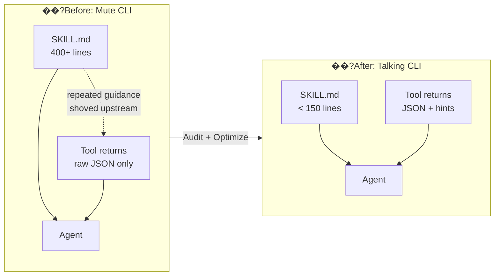
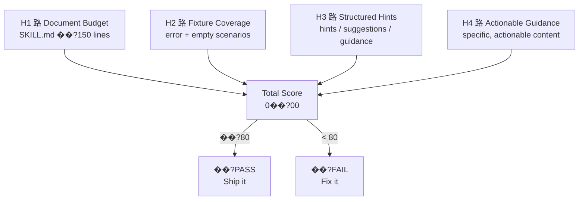

# Talking CLI

> **Make it embarrassing to ship a mute CLI.**

[](LICENSE)
[](https://nodejs.org)

**Your CLI is mute. That's half your prompt problem.**

Every guide on agent skills tells you to optimize your `SKILL.md` ��?the long, one-way monologue you write once and hope the agent remembers. Nobody talks about the other half of your prompt surface: the silent return values of your tools.

When an agent calls your CLI today, the tool runs, returns raw data, and says nothing. No hint about the next step. No signal when results are ambiguous. No cue that "zero hits" means "broaden the query." All of that guidance gets shoved back upstream into `SKILL.md`, which bloats into hundreds of lines of scenario prose no agent can reliably follow.

**Talking CLI** is a design methodology for agent tools that speak back. It treats `SKILL.md` and tool output as **one shared prompt surface with one shared budget**, and gives you concrete rules for deciding what belongs in which channel.

**Prompt-on-call** ��?progressive disclosure taken one level deeper. Instead of pre-loading every scenario into SKILL.md, your tool speaks up when called ��?triggered by what it actually sees, not by what the designer predicted.

Stop writing everything into `SKILL.md`. Give your CLI a voice.

---

## How it works

### The Prompt Budget Shift



### Four Heuristics, Full Coverage



---

## Quick Start

```bash
# Audit your skill ��?default coach mode (plain language, actionable)
npx talking-cli audit ./my-skill

# CI mode ��?machine-readable, exit code driven
npx talking-cli audit ./my-skill --ci

# JSON mode ��?structured output for tooling
npx talking-cli audit ./my-skill --json

# Persona mode ��?same audit, different voice
npx talking-cli audit ./my-skill --persona nba-coach
npx talking-cli audit ./my-skill --persona british-critic
npx talking-cli audit ./my-skill --persona zen-master
npx talking-cli audit ./my-skill --persona emotional-damage-dad

# Audit an MCP server ��?static analysis (fast, safe)
npx talking-cli audit-mcp ./my-mcp-server

# Deep audit ��?runtime M3/M4 heuristics (spawns server)
npx talking-cli audit-mcp ./my-mcp-server --deep

# Generate optimization plan (plan-only, never touches source files)
npx talking-cli optimize ./my-skill
# ��?writes TALKING-CLI-OPTIMIZATION.md at the skill root
```

---

## What it looks like

Coach mode running against a bloated, mute skill:

```
Score: 0/100
Yikes. Your CLI is so quiet I can hear the tokens screaming in agony.

H1 路 Line Count 路 FAIL
Your SKILL.md is 165 lines. The budget is 150.
��?Just 15 lines over. Tighten the prose and migrate post-call guidance to tool hints.

H2 路 Hint Coverage 路 FAIL
1 tool(s) have zero fixtures. They don't speak at all: search
��?Add talking-cli-fixtures for [search]. One error scenario, one empty/zero-result scenario.
  Make them return a "hints" field.

H3 路 Structured Hints 路 FAIL
0/0 passed fixtures contain hint fields.
��?Make your tools return a "hints" or "suggestions" field alongside raw data.

H4 路 Actionable Guidance 路 FAIL
0/0 hint fields have actionable content.
��?Hints should be specific. "Try again" is too short.
  "Try broadening your query with fewer filters" is actionable.

---
Fix the issues above, then run npx talking-cli audit again to see your new score.
```

(The real output is colored. We just can't show chalk in a code block.)

---

## The Methodology

Talking CLI is more than a linter. It's a design philosophy:

- **[PHILOSOPHY.md](PHILOSOPHY.md)** ��?the full methodology: four channels, four rules, a budget, and five anti-patterns.
- **[docs/CN-001](docs/CN-001-tool-scoped-progressive-disclosure.md)** ��?the formal theoretical anchor (*Tool-Scoped Progressive Disclosure*).

---

## Status

**P3 Phase 4 complete. MCP audit M1���M4 complete.**

- ��?H1: `SKILL.md` line-count budget (150 lines)
- ��?H2: Fixture-driven hint coverage detection
- ��?H3: Structured hint fields (`hints`, `suggestions`, `guidance`, etc.)
- ��?H4: Actionable guidance content (length + specificity)
- ��?`optimize --apply`: Auto-fix with safety rules (git branch + backup)
- ��?5 personas: default 路 NBA coach 路 British critic 路 Zen master 路 emotional-damage-dad
- ��?**MCP server audit**: `audit-mcp` with M1���M4 heuristics, `--deep` runtime mode, Python server support
- ��?`optimize --workflow`: 9-step complex skill transformation pipeline

The methodology is stable. The CLI surface may still evolve before v1.0.0.

## License

MIT
