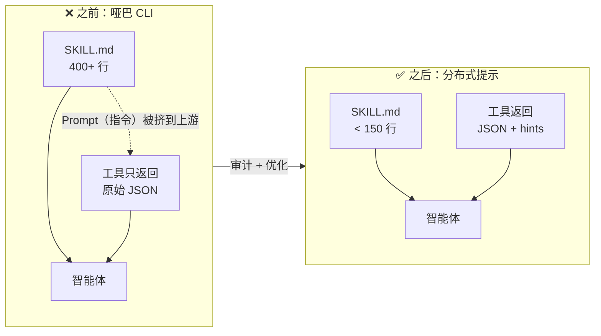
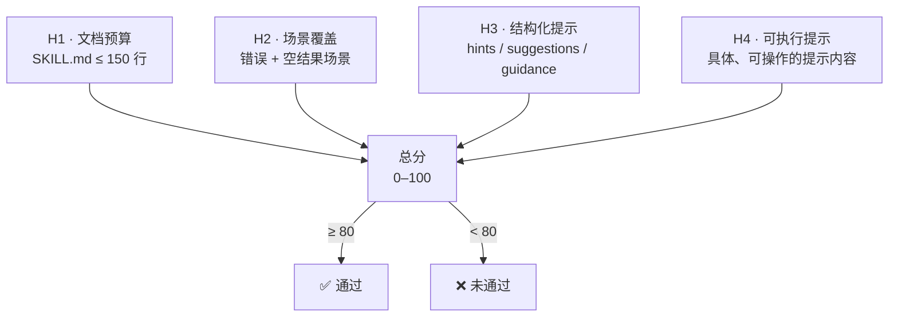

<div align="center">

# Talking CLI

[English](https://github.com/DrDexter6000/talking-cli) · [中文](README.zh-CN.md)

> **工具沉默是病，分布式提示是药。**

[](LICENSE)
[](https://nodejs.org)
[](#核心主张)
[](https://github.com/DrDexter6000/talking-cli/actions)

</div>

---

## 一句话定义

Talking CLI 是一个代码检查工具（linter），它审计你的 AI skill 和 MCP 工具是否把 Prompt（指令）从臃肿的 `SKILL.md` 搬进了工具响应本身 —— 让工具在调用时开口说话。

---

## 核心问题

今天的 AI 工具链有三个通病：

- **工具哑巴**：只返回原始 JSON，对错误、空结果、歧义零提示
- **文档臃肿**：所有"结果为零就放宽"、"结果模糊就问"的后置 Prompt（指令）全塞进 `SKILL.md`，400+ 行每轮全量加载
- **预算浪费**：90% 的提示在 90% 的回合里是无效噪音，智能体却在为它们付 token 租金

---

## 核心主张

> **提示面 = SKILL.md ∪ {tool_result.hints} —— 两面一体，一个预算。**

把只适用于特定工具调用的 Prompt（指令），从静态文档搬到动态响应里。工具被调用时才开口，开口只说当下的事。这就是 **调用即提示（Prompt-On-Call）**；所有工具的调用即提示叠加起来，就是 **分布式提示（Distributed Prompting）**。

| 🎯 Token 节省 | 🧪 验证规模 | 🤖 模型覆盖 | 🔍 生态审计 |
|:---:|:---:|:---:|:---:|
| **17–26%** | **2,340+** 次执行 | **3** 个前沿模型 | **0/68** 通过 |
| 精简 Skill + 工具提示 | 跨难度、跨模型 | DeepSeek / Kimi / GLM | 4 个 Anthropic 官方 MCP 服务器 |

[Anthropic](https://www.anthropic.com/engineering/writing-tools-for-agents) 和 [Carmack](https://x.com/ID_AA_Carmack/status/1874124927130886501) 曾指过这个方向，但此前没有人给它命名、量化预算、审计效果 —— 直到现在。

<details>
<summary><strong>站在巨人的肩膀上</strong> —— 为什么是现在？</summary>

CLI 是 AI 智能体的原生接口 —— [Carmack](https://x.com/ID_AA_Carmack/status/1874124927130886501)、[CodeAct](https://arxiv.org/abs/2402.01030)（Wang 等，ICML 2024）和 [Karpathy](https://x.com/karpathy/status/2026360908398862478) 奠定了这一方向。

[渐进式披露](https://www.anthropic.com/engineering/equipping-agents-for-the-real-world-with-agent-skills)（**Progressive Disclosure**）作为 skill-loading 架构由 Anthropic 于 2025 年 10 月正式提出，现已成为[开放标准](https://agentskills.io)。Anthropic 还倡导["在工具响应中用有益指令引导智能体"](https://www.anthropic.com/engineering/writing-tools-for-agents) —— 但仅作为段落级别的最佳实践。此前没有人给它命名、量化预算、审计效果，或将其作为协议级原语提出。**这个空白正是 Talking CLI 要填补的。** 我们相信**调用即提示** / **分布式提示**就是这个理念的下一步进化形态。

</details>

---

## 系统如何工作

### 机制：提示预算的搬迁

| | 哑巴 CLI（之前） | 分布式提示（之后） |
|---|---|---|
| **SKILL.md** | 400+ 行，每轮全量加载 | < 150 行，只保留通用 Prompt（指令） |
| **工具响应** | 原始 JSON，零提示 | JSON + `hints` 字段，场景化 Prompt（指令） |
| **提示成本** | 每轮支付 400 行租金 | 只在调用时支付精准提示 |
| **审计方式** | 无 | `talking-cli audit` 四项打分 |

<details>
<summary>📊 可视化：前后对比</summary>



</details>

### 四项启发式打分

| 指标 | 检查内容 | 通过标准 |
|---|---|---|
| **H1 · 文档预算** | SKILL.md 行数 | ≤ 150 行 |
| **H2 · 场景覆盖** | 错误 + 空结果场景 | 每个工具至少 2 个 fixture |
| **H3 · 结构化提示** | 响应是否含 hint 字段 | `hints` / `suggestions` / `guidance` |
| **H4 · 可执行提示** | 提示内容是否具体可操作 | ≥ 10 字符且含动作指令 |

> 总分 0–100，≥ 80 通过。

<details>
<summary>📊 可视化：打分流程</summary>



</details>

---

## 快速开始

```bash
# 审计你的 skill —— 自然语言报告，告诉你改什么
npx talking-cli audit ./my-skill

# CI 模式 —— 机器可读，靠退出码判断
npx talking-cli audit ./my-skill --ci

# JSON 模式 —— 结构化输出，方便工具链集成
npx talking-cli audit ./my-skill --json

# 审计 MCP 服务器 —— 静态分析（快速、安全）
npx talking-cli audit-mcp ./my-mcp-server

# 深度审计 —— 运行时启发式（会启动服务器）
# ⚠️ 只对可信服务器使用 --deep。详见 SECURITY.md。
npx talking-cli audit-mcp ./my-mcp-server --deep

# 生成优化方案（只出方案，绝不改源文件）
npx talking-cli optimize ./my-skill

# 脚手架：生成自带审计通过的 skill 模板
npx talking-cli init my-skill
```

所有命令纯本地运行 —— 不需要 API key。

---

## 实验验证

### MCP 生态审计

**0 / 68。** 扫描 4 个 Anthropic 官方 MCP 服务器的 68 个错误 / 空结果场景，无一返回可执行提示。对 823 个 Composio 工具的静态分析结果一致。

| 服务器 | 工具数 | 场景数 | 返回提示 |
|---|---|---|:---:|
| `server-filesystem` | 11 | 21 | **0** |
| `server-everything` | 13 | 13 | **0** |
| `server-memory` | 9 | 9 | **0** |
| `server-github` | 25 | 25 | **0** |
| **合计** | **58** | **68** | **0 / 68** |

### 跨模型验证（2,340+ 次执行）

2×2 消融实验（精简/完整 Skill × 静音/带提示工具），3 个前沿模型，45 个 MCP 任务（每组 3 轮）；追加 15 道高难度任务再验 2 个模型：

| 模型 | 完整/静音 | 精简/提示 | Δ | Token 节省 | 高难基准 | 高难 Δ | 高难节省 |
|---|---|---:|:---:|:---:|:---:|:---:|:---:|
| DeepSeek V4 Pro | 91.1% | 90.4% | −0.7 | **−17%** | 22.2% / 22.2% | 0.0 | **−24%** |
| Kimi K2.6 | 88.1% | 90.4% | +1.5 | **−18%** | — | — | — |
| GLM-5.1 | 90.4% | 93.3% | +2.2 | **−22%** | 20.0% / 20.0% | 0.0 | **−26%** |

**数据支持：**
- **Token 节省跨模型、跨难度**：17–26%，质量零下降
- **无害**：最差情况 −0.7pp，在噪音范围内
- **Skill 膨胀真实存在**：SkillsBench（36K skill）独立验证，臃肿 skill 降 −2.9pp，精简 skill 升 +18.8pp

**数据不支持：**
- 通过率提升不具统计显著性（p = 1.0）—— token 节省已证明，质量信号仍待捕获
- **臃肿 skill 上叠加提示会适得其反**（GLM-5.1：−6pp）。分布式提示只在 skill 先精简时才有效

---

## 下一步

1. **更高难度的基准** —— 任务标定到 40–60% 基线，暴露天花板效应掩盖的质量信号
2. **MCP 规范提案** —— 为工具响应添加一等公民 `agent_hints` 字段的 RFC
3. **H4 语义升级** —— 将 `≥ 10 字符` 启发式替换为轻量级分类器

---

## 许可证

MIT
